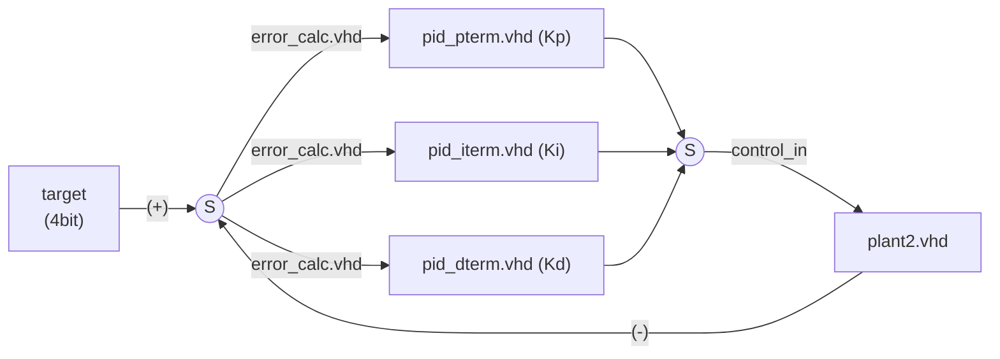

# PID Temperature Controller
Implemented in VHDL for Basys-3 FPGA using Vivado. 

Implementation details:
* 4bit target mapped to switches on board.
* Fixed-point arithmetic in Q8.8.



## Phase 1: P-term only. 
We develop all the code to run a p-only controller. Signals are exposed at the top level to export signals to csv, plotted below.


```python
import polars as pl
import seaborn as sns
sim_data = r'C:\prog\fpga\PID_temp_controller\PID_temp_controller.sim\sim_1\behav\xsim\pid_simulation_data.csv'
df = pl.read_csv(sim_data)

dfp = df.with_columns(
    ((pl.col('Time')*1e-9)*1e3).alias('time_ms')
)
#dfp.head()
```


```python
sns.relplot(dfp, x='time_ms',y='error_signal')
```


    <seaborn.axisgrid.FacetGrid at 0x282513b1880>


    

    


**Zooming in on value that it settles at:**


```python
sns.relplot(dfp.filter(pl.col('time_ms') > 24), x='time_ms',y='error_signal')
```


    <seaborn.axisgrid.FacetGrid at 0x2825230ba40>


    

    


```python

```
